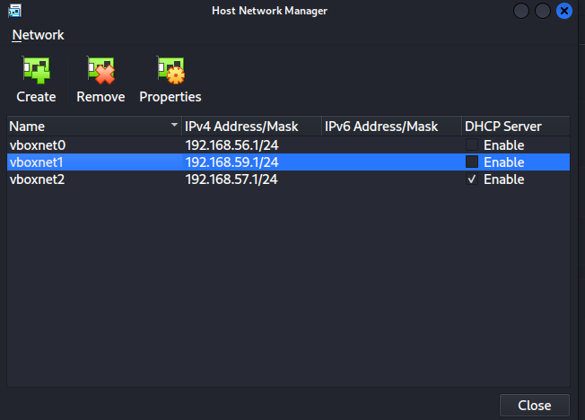

## Lab2 Vagrantfile

Vagrantfile of this lab can be a bit difficult to understand at first. But following this README file, everything can be clear.

- `Vagrant.configure("2")do |config|` is the begineer line for every Vagrantfile. Here method is created with variable `config`.
As we can see, we are using the same ubuntu image that we have used in [Lab1]().
- `config.vm.box = "ubuntu/xenial64"`: This command assigned the image name we will using.
- `config.vm.hostname = "box1"`: This command is used to give custom name to the box. This will help us to manage the box more easily.
- `config.vm.network "private_network", ip: "192.168.57.2"`: This is used to assigned private network to our box. The IP address here must be available in your `Virtualabox` network.

- `config.vm.synced_folder "../Synced_folder", "/home/vagrant/Synced_folder"`: This is used to include any folder to be synced inside the vagrant box.

<b>Remember:</b> There is only one box in this vagrantfile so the folder will only  synced with "box1". But in case of having multiple box in one single Vagrantfile, the folder will be synced with everybox.

- `config.vm.provision "file", source: "./Lab2_FileToCopy.txt", destination: "/home/vagrant/Copy_folder"`: This is used to copy any file outside the synced folder.

- `config.vm.provider :virtualbox do |vb|`: This code assigned that we are using `virtualbox` as Vm provider. And we are again using method with variable `vb` to perform task.

- `vb.customize ["modifyvm", :id, "--memory", 1024]`: This is used to customized the vm resource according to our need. This will assign 1024MB memory for our Box  `box1`.    

- `vb.customize ["modifyvm", :id, "--cpus", 1]`: This will assign 1 core CPU  for our Box  `box1`.
- The method are close with the `end` command.

