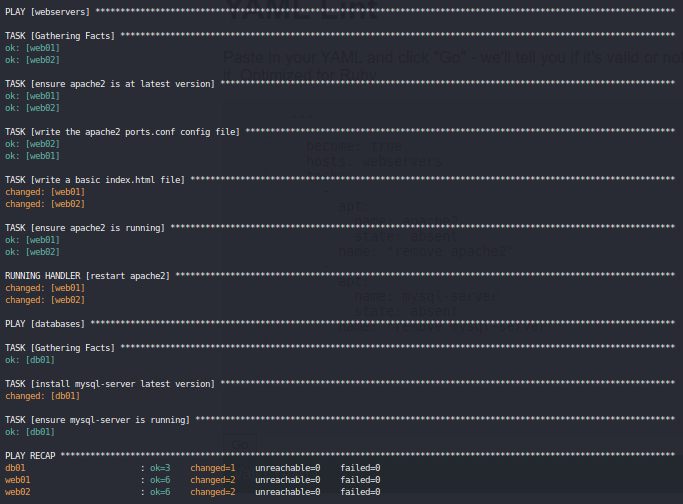
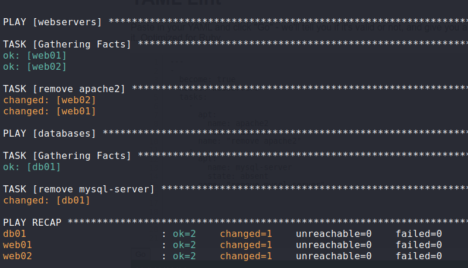

# Lab2 - Playbook and Templates

## Playbook
- Using `ad-hoc` command for a small task is easy. But using it for multiple tasks is not easy.
- So Ansible makes a use of playbook which simply is a [YAML](https://www.cloudbees.com/blog/yaml-tutorial-everything-you-need-get-started) script containing multiple tasks.
- Playbook for this Lab2 can be found in [playbooks](https://github.com/TheSpiritMan/DevOps-Practice/tree/main/02%20Ansible/Lab2%20-%20Playbooks%20and%20Templates/playbooks) folder.
- In playbook files, there are 2 hosts: `webservers` and `databases`.
- Everything can be easily understood except `template`, `notify` and `handlers`. 

### Template
- Template such as Ninja which file extension is `.j2` can be used for a ansible task.
- Two templates are used in this Lab. They can be found inside [templates](https://github.com/TheSpiritMan/DevOps-Practice/tree/main/02%20Ansible/Lab2%20-%20Playbooks%20and%20Templates/templates) folder.
- Template includes two key-value pairs. They are `src` for source and `dest` for destination.

### Notify
- `notify` is which to trigger handler.
- Notify includes String which must match with `handler` name to trigger handler.
- Notify is called only when it's task is completed.

### Handler
- `handlers` can only be triggerred when `notify` is successfully called.
- `name` of handlers must match with `notify`. 


## Command to run playbook
```
ansible-playbook -i $inventoryFile -K $playbookFile
```
- `ansible-playbook` is for playbook.
- `-i` flag is for inventory file
- `$inventoryFile` is name for inventory file.
- `-K` flag is for playbook.
- `$playbookFile` is name for playbook file.

## Access ansible-control
```
vagrant ssh anible-control
cd /vagrant/Lab2\ -\ Playbooks\ and\ Templates/
```

## Example 1: Install apache2 and mysql-server
Use following command:
```
ansible-playbook -i ../inventory  -K playbooks/install_playbook.yml
```
- `../inventory` is because `inventory` file is located 1 directory back.
- `install_playbook.yml` is playbook file.

Output:




### Confirm Apache2 is running our html file.
- In `install_playbook.yml` file, we have a task to copy the `index.html` file in `/var/www/html` location.

### Command to check:
- For web01:
```
curl web01:8000
```
Output:
```
<html>
    <h1> Hello World! </h1>
</html>
```
- Do same for `web02`.

## Example 2: Remove apache2 and mysql-server
Use following command:
```
ansible-playbook -i ../inventory -K playbooks/remove_playbook.yml
```
- `remove_playbook.yml` is playbook file.

Output:




<h1>This is for Lab2- Playbook and Templates.</h1>