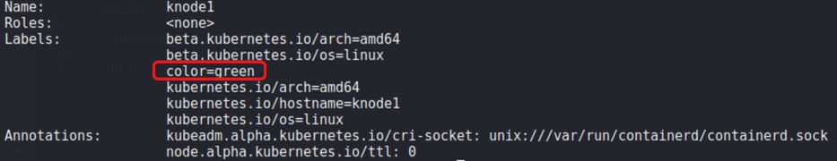
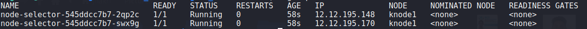

# <b>Node Selector</b>
- Scheduler can selector a matching labels for a task.
- Syntax:
    ```
    spec:
        nodeSelectorl:
            color: "green"
    ```
- For this to work, atleast one node should have that matching labels.
- Command to add labels to your node:
    ```
    kubectl label node knode1 color=green
    ```
- Verify labels is added to `knode1`.
- Command:
    ``` 
    kubectl describe node knode1 | head
    ```
- Output:

    

- Deploy `example 1`, it must be deployed in `knode1`.
    
