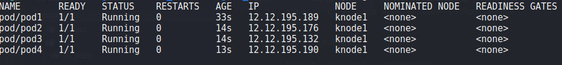
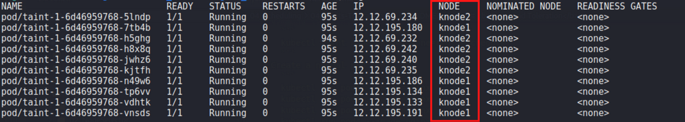
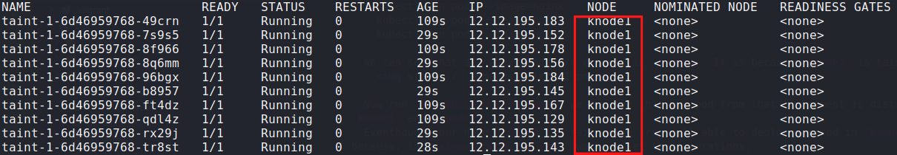

# <b>Taints and Toleration</b>
- <b>NoSchedule</b>
- <b>NoExecute</b>

## Examples
- <b>NoSchedule</b>
    - Command to taints node:
        ```
        kubectl taint node knode2 zone=red:NoSchedule
        ```
    - Create a normal pod:
        ```
        kubectl run pod1 --image=nginx
        kubectl run pod2 --image=nginx
        kubectl run pod3 --image=nginx
        kubectl run pod4 --image=nginx
        ```
    - We can see that all above pods are created in `knode1`. It is because `knode2` is tainted.
        

    - Now run `ex1-noscheduling.yaml`, we can see that the pod from that deployment is distribued between `knode1` and `knode2`.
    - Eventhough, our node `knode2` is tainted,we are still able to deploy our pod in `knode2`. It is because, in `ex1-noscheduling.yaml` we have set the tolerations.
        

- <b>NoExecute</b>
    - Command to taints node:
        ```
        kubectl taint node knode2 danger=serious:NoExecute
        ```
    - Now all the pod running in `knode2` will be terminated and another pod in `knode1` will be created automatically.
        

- <b>Remove Taint</b>:
   - Just add `-` sign at the end of the above command. The taints will be removed automatically.
        ```
        kubectl taint node knode2 zone=red:NoSchedule-
        kubectl taint node knode2 danger=serious:NoExecute-
        ```