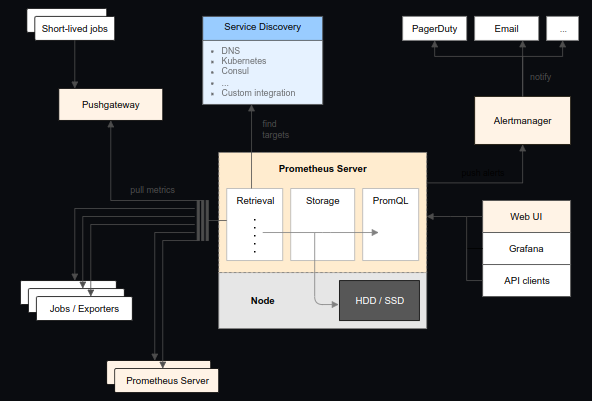
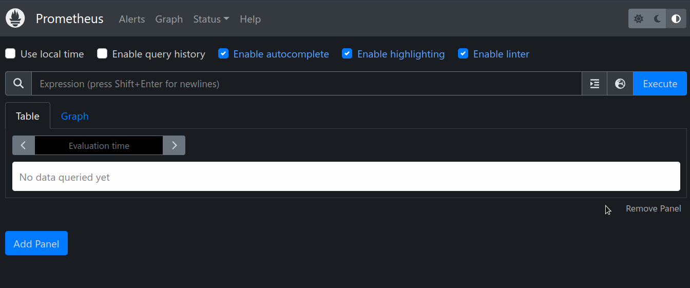

# <b>Prometheus</b>
Prometheus, a Cloud Native Computing Foundation project, is a systems and service monitoring system. It collects metrics from configured targets at given intervals, evaluates rule expressions, displays the results, and can trigger alerts when specified conditions are observed.

The features that distinguish Prometheus from other metrics and monitoring systems are:

- A multi-dimensional data model (time series defined by metric name and set of key/value dimensions)
- PromQL, a powerful and flexible query language to leverage this dimensionality
- No dependency on distributed storage; single server nodes are autonomous
- An HTTP pull model for time series collection
- Pushing time series is supported via an intermediary gateway for batch jobs
- Targets are discovered via service discovery or static configuration
- Multiple modes of graphing and dashboarding support
- Support for hierarchical and horizontal federation
- Official Github page: https://github.com/prometheus/prometheus

## <b>Prometheus Architecture</b>
   


## <b>Install Prometheus</b>
- Command:
    ```
    kubectl apply -f prometheus.yaml
    ```
- It creates a new namespace `monitoring` and deployment everything in this namespace.

## <b>Validate Prometheus</b>
- Command:
    ```
    kubectl get all -n monitoring
    ```
- Output:
    ```
    NAME                                         READY   STATUS    RESTARTS   AGE
    pod/prometheus-deployment-748975c585-zq8gv   1/1     Running   0          60s

    NAME                         TYPE       CLUSTER-IP      EXTERNAL-IP   PORT(S)          AGE
    service/prometheus-service   NodePort   10.97.249.207   <none>        8080:32059/TCP   60s

    NAME                                    READY   UP-TO-DATE   AVAILABLE   AGE
    deployment.apps/prometheus-deployment   1/1     1            1           60s

    NAME                                               DESIRED   CURRENT   READY   AGE
    replicaset.apps/prometheus-deployment-748975c585   1         1         1       60s

    ```

## <b>Prometheus Dashboard</b>
- From above output, we can see that the service is running as <b>NodePort</b> type in Port <b>32059</b>.
- Open browser and visit [http://<any_node_ip>:32059]().
- I will use my master node IP i.e 192.168.57.20 [http://192.168.57.20:32059]().
    