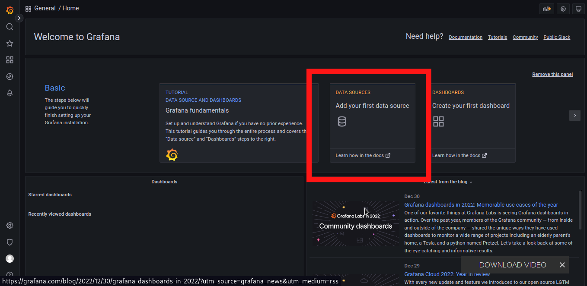
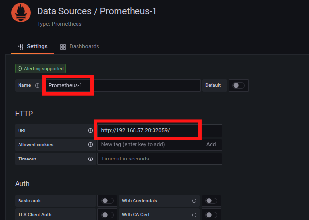
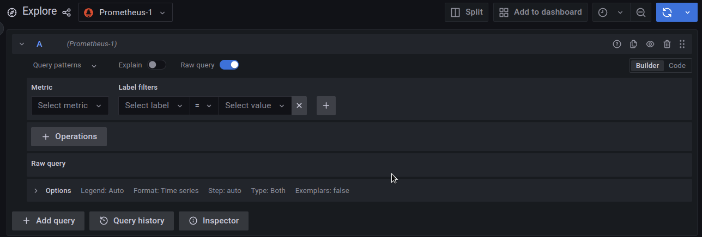

# <b>Grafana</b>
- Grafana gives more visual option than prometheus.
- Command:
    ```
    kubectl apply -f grafana.yaml
    ```
- It create deployment and a service.
- It will take some time to run the deployment.

## <b>Validata Grafana</b>
- Command: 
    ```
    kubectl get all -n monitoring
    ```
- Output:
    ```
    NAME                                         READY   STATUS    RESTARTS   AGE
    pod/grafana-85844dcbff-5pqlm                 1/1     Running   0          11m
    pod/prometheus-deployment-748975c585-zq8gv   1/1     Running   0          27m

    NAME                         TYPE       CLUSTER-IP       EXTERNAL-IP   PORT(S)          AGE
    service/grafana-ui-svc       NodePort   10.105.217.109   <none>        3000:32519/TCP   11m
    service/prometheus-service   NodePort   10.97.249.207    <none>        8080:32059/TCP   27m

    NAME                                    READY   UP-TO-DATE   AVAILABLE   AGE
    deployment.apps/grafana                 1/1     1            1           11m
    deployment.apps/prometheus-deployment   1/1     1            1           27m

    NAME                                               DESIRED   CURRENT   READY   AGE
    replicaset.apps/grafana-85844dcbff                 1         1         1       11m
    replicaset.apps/prometheus-deployment-748975c585   1         1         1       27m
    ```

- Grafana is deployed in <b>monitoring</b> namespace.

## <b>Grafana Dashboard</b>
- From above output, we can see that the service is running as <b>NodePort</b> type in Port <b>32519</b>.
- Open browser and visit [http://<any_node_ip>:32519]().
- I will use my master node IP i.e 192.168.57.20 [http://192.168.57.20:32519]().
- Use <b>admin:admin</b> as default username and password.
- Set <b>admin123</b> as a new password.
- Click on <b>Add your first data source</b>.

    

- Select <b>Prometheus</b> from the list of Data Source.

    

- Give a name and set the <b>URL</b> of Prometheus and save it.

    

- Now, go to <b>Explore</b>. We can see interface like below:
    
    

- We can perform all the monitoring in <b>Explore</b> page.